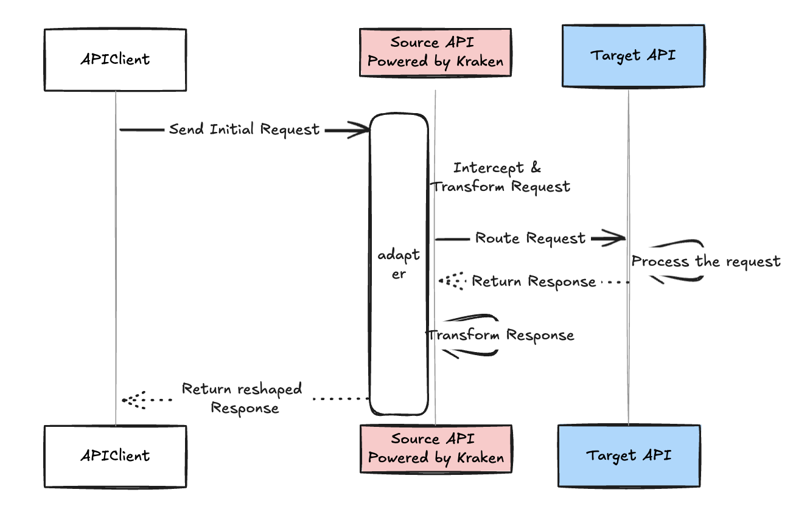

# Kraken

## Overview

Kraken is a comprehensive API mapping solution designed to bridge the gap between disparate APIs with varying data structures, enabling seamless communication between systems. It focuses on mapping non-standard or legacy APIs to standardized interfaces, simplifying integration and ensuring interoperability between business systems.


## Core Functionalities
At its heart, Kraken is an API mapping engine. It facilitates communication between a source API (like Sonata API) and a target API (such as proprietary or non-standard seller APIs) by transforming and mapping their data structures. The engine essentially acts as a adapter layer that abstracts the differences between APIs, allowing them to communicate without the need for significant redevelopment.

## Key Features
- **Mapping Flexibility**: Users can create mappings between a source Endpoint and a target Endpoint and mapping their request and response properties, allowing data from one API format to be converted and routed to the corresponding fields in another API.
- **Target API Setup**: The interface also provides functionality to configure the taget API server. This is essential for integrating APIs that have not yet been standardized or exposed to the platform. Users can upload the configuration of the target API and set it up for smooth interaction.
- **API activity tracking**: All the API calls to Source API through Kraken will be captured for future debugging and analysis

## Benefits
- **Simplified API Integration**: By abstracting the complexity of different API structures, the solution reduces the development effort required to integrate APIs, offering a plug-and-play model.
- **Flexibility**: The tool supports a wide range of API mappings, allowing for customization and specific configurations depending on the API needs.
- **Monitoring and Analytics**: The platform offers monitoring capabilities to track API performance and ensure data is flowing as expected.


## Architecture

Kraken follows a modular architecture, comprising several components that work together to deliver its functionality:


- **Control Plane**: This layer is responsible for the configuration and management of API mappings. Users interact with this layer to define, map, and deploy APIs.
- **Data Plane**: The data plane handles the actual data flow, ensuring that requests and responses are properly mapped and delivered between the source and target API Servers.

### Key Components

- **Kraken Hub**: Kraken Hub acts as a high-performance Ingress Controller, efficiently routing external traffic to services within your infrastructure. It seamlessly integrates with your existing network infrastructure, providing a reliable entry point for incoming requests.

- **Kraken Agent**: Sync all hub's activities to controller server and pull latest configuration from controller server.

- **Kraken Controller**: Customize API mapping rules, manage mapping versions and release mappings to data plane.

- **Kraken Portal**: Management Portal.

## Get Started

### Prerequisites

Before compile the source code, ensure you have the following prerequisites:

- Maven
- JDK 17 or later
- Node 20 or later
- NPM

### Run Kraken

#### Step 1 - Clone the source code
```console
git clone git@github.com:mycloudnexus/kraken.git
cd kraken
```

#### Step 2 - Compile the Kraken API servers

1. Run tests:

```shell
mvn test
```

2. Package the application:

```shell
mvn package
```

#### Step 3 - Run API Servers

There are 3 API servers, (controller, Hub and Agent)

3.1 Run Kraken App Hub

```shell
java -jar kraken-app/kraken-app-hub/target/*.jar
```

Then can open the API server swagger-ui via http://localhost:8000

3.2 Run Kraken App Controller

```shell
java -jar kraken-app/kraken-app-controller/target/*.jar
```
Then can open the API server swagger-ui via http://localhost:8001


3.3 Run Kraken App Agent

```shell
java -jar kraken-app/kraken-app-agent/target/*.jar
```
Then can open the API server swagger-ui via http://localhost:8002

#### Step 4 - Run Portal

```
cd kraken-app/kraken-app-portal
npm install
npm run dev
```
Then open the portal via http://localhost:5173/
The default login is admin/admin


### Build docker images

There is a bash to build the docker images 
```
./docker/dockerBuild.sh
```
It will build the following docker images:

- mycloudnexus/kraken-app-hub:latest
- mycloudnexus/kraken-app-controller:latest
- mycloudnexus/kraken-app-agent:latest
- mycloudnexus/kraken-app-portal:latest

Then you can run them via docker-compose.yaml

```
cd docker
docker-compose up
```

if everything run correctly, the following servers are up:

- Portal: http://localhost:3000
- Controller: http://localhost:8001
- Hub: http://localhost:8000
- Agent: http://localhost:8002


### Code Structure
```
kraken/
│
├── kraken-app/
│   └── kraken-app-controller/
│   │   └── src
│   │   │   └── main
│   │   │   └── test
│   │   └── pom.xml
│   └── kraken-app-agent/
│   └── kraken-app-hub/
│   └── kraken-app-portal/
│   └── pom.xml
│
├── kraken-java-sdk/
│   └── kraken-java-sdk-core/
│   │   └── src
│   │   │   └── main
│   │   │   └── test
│   │   └── pom.xml
│   └── kraken-java-sdk-auth/
│   └── kraken-java-sdk-controller/
│   └── kraken-java-sdk-sync/
│   └── kraken-java-sdk-gateway/
│   └── kraken-java-sdk-mef/
│   └── kraken-java-sdk-test/
│   └── pom.xml
│
├── docs/
│   └── developer_guide.md
│   └── configuration.md│
│
├── .github/
│   ├── workflows/
│   │   └── ci.yml
│   ├── ISSUE_TEMPLATE/
│   │   └── bug_report.md
│   │   └── feature_request.md
│   ├── PULL_REQUEST_TEMPLATE.md
│   └── CODE_OF_CONDUCT.md
│
├── .mvn/
│   └──jvm.config
│
├── docker/
│   ├── deployment-config/
│   │   └── app-agent-config.yaml
│   │   └── app-hub-config.yaml
│   │   └── app-controller-config.yaml
│   ├── docker-compose.yaml
│
├── Dockerfile
├── README.md
├── CONTRIBUTING.md
├── LICENSE.md
├── CHANGELOG.md
├── pom.xml
└── .gitignore

```

### Configuration

The behavior of the Kraken can be customized using command-line arguments or environment variables. Refer to the [Configuration](./docs/configuration.md) documentation for a list of available options and their descriptions.


## Contributing

We welcome contributions from the community! If you'd like to contribute to the Kraken project, please follow our [Contribution Guidelines](./CONTRIBUTING.md).

## Coding Standards

This project follows the [Google Java Style Guide](https://google.github.io/styleguide/javaguide.html) for coding conventions. Please ensure that your code adheres to these standards before submitting a pull request.

## License

This project is licensed under the [Apache 2.0](./LICENSE).
